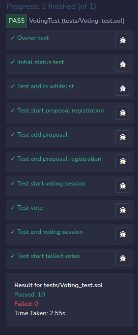

# Files

```
.
├── contracts               # Contract files
├──── Voting.sol            # File to review
├──── VotingCi.sol          # Same file only use for tests (visibility changed from external to public)
├── docs                    # Documentation files
├── test                    # Unit tests
├── LICENSE
└── README.md
```

# Tests

Les tests ont été rédigés et executé sur Remix sur le contrat `VotingForTU.sol`, la seul différence avec Voting.sol est la visibilité des fonctions (`external` => `public`)



# Instruction

* ✔️ Le vote n'est pas secret
* ✔️ Chaque électeur peut voir les votes des autres
* ✔️ Le gagnant est déterminé à la majorité simple
* ✔️ La proposition qui obtient le plus de voix l'emporte.

## 👉 Le processus de vote

* ✔️ L'administrateur du vote enregistre une liste blanche d'électeurs identifiés par leur adresse Ethereum.
* ✔️ L'administrateur du vote commence la session d'enregistrement de la proposition.
* ✔️ Les électeurs inscrits sont autorisés à enregistrer leurs propositions pendant que la session d'enregistrement est active.
* ✔️ L'administrateur de vote met fin à la session d'enregistrement des propositions.
* ✔️ L'administrateur du vote commence la session de vote.
* ✔️ Les électeurs inscrits votent pour leur proposition préférée.
* ✔️ L'administrateur du vote met fin à la session de vote.
* ✔️ L'administrateur du vote comptabilise les votes.
* ✔️ Tout le monde peut vérifier les derniers détails de la proposition gagnante.

## 👉 Les recommandations et exigences 

* ✔️ Votre smart contract doit s’appeler “Voting”.
* ✔️ Votre smart contract doit utiliser la dernière version du compilateur.
* ✔️ L’administrateur est celui qui va déployer le smart contract.
* ✔️ Votre smart contract doit définir les structures de données suivantes :

```solidity
struct Voter {
    bool isRegistered;
    bool hasVoted;
    uint votedProposalId;
}
struct Proposal {
    string description;
    uint voteCount;
}
```

* ✔️ Votre smart contract doit définir une énumération qui gère les différents états d’un vote

```solidity
enum WorkflowStatus {
    RegisteringVoters,
    ProposalsRegistrationStarted,
    ProposalsRegistrationEnded,
    VotingSessionStarted,
    VotingSessionEnded,
    VotesTallied
}
```
* ✔️ Votre smart contract doit définir un uint winningProposalId qui représente l’id du gagnant ou une fonction getWinner qui retourne le gagnant.
* ✔️ Votre smart contract doit importer le smart contract la librairie “Ownable” d’OpenZepplin.
* ✔️ Votre smart contract doit définir les événements suivants :
```solidity
event VoterRegistered(address voterAddress);
event WorkflowStatusChange(WorkflowStatus previousStatus, WorkflowStatus newStatus);
event ProposalRegistered(uint proposalId);
event Voted (address voter, uint proposalId);
```
