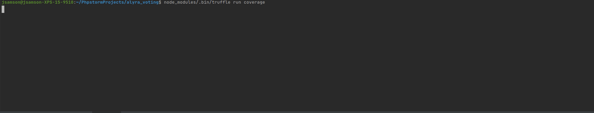

[](https://coveralls.io/github/JeremieSamson/alyra_voting)
# Installation

First you need to clone the project 

```
git clone git@github.com:JeremieSamson/alyra_voting.git
```

Then you will need to install the project dependencies, if you are familiar with docker there is a [special instruction file](docs/docker.md) for it.

## Dependencies

In order to install all dependencies (ganache, truffle ...), please do like the following

```
npm install

// To install truffle globaly
npm install -g truffle

// To install ganache globaly
npm install -g ganache-cli
```

## Tests

To run the project tests suite, do the following

```
// Run ganache localy
ganache-cli -h 127.0.0.1

// Run migrations
truffle migrate

// Launch test suite
truffle test
```



- 33 tests passing
- Every functions are tested 

### VotingTest.js

#### 1. Contract ownership

- ✔ Contract ownership
- ✔ Ownership has been transferred

#### 2. Get voter informations

- ✔ As a voter, I should not be able to get a vote if I am not registered
- ✔ As a voter, I should be able to get my own vote
- ✔ As a voter, I should be able to get others vote ⚠️

#### 3. Get One proposal informations

- ✔ As a voter, I should not be able to get a proposal if I am not registered
- ✔ As a voter, I should be able to get a proposal informations

### 4. As the owner, I should be able to update the workflow status

- ✔ The workflow status must start with RegisteringVoters
- ✔ Only startProposalsRegistering can be done with RegisteringVoters status
- ✔ The workflow status must start with RegisteringVoters
- ✔ Only endProposalsRegistering can be done with ProposalsRegistrationStarted status
- ✔ The workflow status must start with ProposalsRegistrationStarted
- ✔ Only startVotingSession can be done with ProposalsRegistrationEnded status
- ✔ The workflow status must start with ProposalsRegistrationEnded
- ✔ Only startVotingSession can be done with ProposalsRegistrationEnded status
- ✔ The workflow status must start with VotingSessionStarted status

### 5. As the owner, I should be able to add voters

- ✔ Only the owner can add voters
- ✔ A voter can not access voters information if he has not been registered
- ✔ A voter can be registered
- ✔ An address could not be registered more than once

### 6. As a voter, I should be able to add a proposal

- ✔ Only a voter can add a proposal
- ✔ A voter can't add an empty proposal
- ✔ A voter can add a proposal
- ✔ A voter can add another proposal

### 7. As a voter, I should be able to vote

- ✔ Only a voter can vote
- ✔ A voter can't vote on a wrong status
- ✔ A voter can not vote on an inexisting proposal
- ✔ A voter can vote on an existing proposal
- ✔ A voter can not vote another time
- ✔ A proposal should be incremented after a vote

### 8. As the owner, I should be able to tally

- ✔ Only the owner can tally
- ✔ A owner can't tally on a wrong status
- ✔ A owner can tally
- ✔ The winningProposalID must be proposalIdLoremDolor after tally
- ✔ The workflow status must be equal to VotesTallied after tally

## Feature list 

The list of feature for the project can be found [here](docs/features.md)
    
